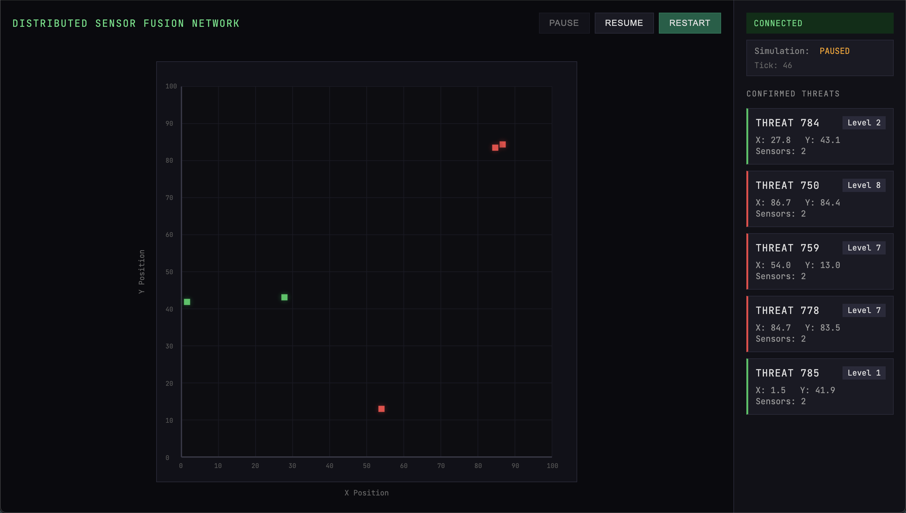

# Distributed Sensor Fusion Network

A distributed system for fusing sensor readings from multiple sources to detect and track threats in a simulated world. The system uses gRPC for inter-service communication and provides a real-time web dashboard for visualization.



## Architecture

The system consists of four main components:

1. **World Server** - Simulates a 2D world with moving threats and provides ground truth data
2. **Command Server** - Receives sensor readings, performs fusion/clustering, and confirms threats
3. **Sensors** - Distributed clients that observe the world and report readings
4. **Frontend Dashboard** - Real-time visualization of confirmed threats via WebSocket

## Components

### World Server (`cmd/worldserver/`)

- Simulates threats moving in a 100x100 toroidal world
- Provides gRPC streaming service for world state updates
- HTTP control API for pause/resume/restart operations
- Configurable number of threats and world dimensions

**Ports:**
- `:50051` - gRPC service for world state streaming
- `:8081` - HTTP control API

### Command Server (`cmd/commandserver/`)

- Receives sensor readings via gRPC
- Performs spatial clustering to fuse readings from multiple sensors
- Confirms threats when minimum sensor threshold is met (default: 2 sensors)
- Broadcasts confirmed threats via WebSocket to frontend
- Handles toroidal wrap-around for position calculations

**Ports:**
- `:50052` - gRPC service for sensor readings
- `:8080` - WebSocket server for frontend

**Fusion Algorithm:**
- Clusters readings within a configurable radius (default: 10 units)
- Requires readings from multiple sensors to confirm threats
- Uses confidence-weighted circular mean for position fusion
- Automatically cleans up stale threats

### Sensors (`sensor/`)

- Distributed clients that observe the world
- Stream readings to the command server via gRPC
- Can add noise and observation errors to simulate real-world conditions

### Frontend Dashboard (`frontend/`)

- Real-time radar-style visualization of confirmed threats
- Shows threat positions, levels, and sensor counts
- Displays connection status and simulation state
- Control buttons for pause/resume/restart
- Terminal-style monospace font (JetBrains Mono)

## Building

### Prerequisites

- Go 1.24.0 or later
- Protocol Buffer compiler (`protoc`)
- Go plugins for protoc:
  ```bash
  go install google.golang.org/protobuf/cmd/protoc-gen-go@latest
  go install google.golang.org/grpc/cmd/protoc-gen-go-grpc@latest
  ```

### Generate Protocol Buffers

```bash
make proto
```

This generates Go code from the `.proto` files in `proto/` to `shared/generated/`.

### Build Binaries

```bash
go build -o worldserver ./cmd/worldserver
go build -o commandserver ./cmd/commandserver
go build -o sensortest ./cmd/sensortest
go build -o worldtest ./cmd/worldtest
```

## Running

### 1. Start World Server

```bash
./worldserver
```

This starts the world simulation with 3 threats in a 100x100 world.

### 2. Start Command Server

```bash
./commandserver
```

This starts the fusion engine with:
- Cluster radius: 10 units
- Minimum sensors: 2

### 3. Open Frontend

Open `frontend/index.html` in a web browser. The dashboard will connect to:
- WebSocket: `ws://localhost:8080/ws`
- Control API: `http://localhost:8081`

### 4. (Optional) Run Test Clients

```bash
./sensortest  # Test sensor client
./worldtest   # Test world client
```

## Protocol Buffers

The system uses Protocol Buffers for service definitions:

- `proto/world.proto` - World state and threat definitions
- `proto/sensor.proto` - Sensor reading format and streaming service

## Project Structure

```
.
├── cmd/
│   ├── commandserver/  # Command server main
│   ├── worldserver/    # World server main
│   ├── sensortest/     # Sensor test client
│   └── worldtest/      # World test client
├── command/            # Command server logic (fusion, websocket)
├── world/              # World simulation (physics, truth)
├── sensor/             # Sensor client implementation
├── proto/              # Protocol Buffer definitions
├── shared/generated/   # Generated protobuf code
├── frontend/           # Web dashboard
└── Makefile            # Build automation
```

## Features

- **Distributed Architecture** - Multiple sensors can report independently
- **Spatial Clustering** - Groups nearby readings from different sensors
- **Confidence Weighting** - Uses sensor confidence in position fusion
- **Toroidal World** - Handles wrap-around at world boundaries
- **Real-time Updates** - WebSocket streaming for live dashboard
- **Simulation Control** - Pause, resume, and restart capabilities
- **Threat Expiration** - Automatically removes stale threats

## Configuration

Default parameters can be modified in the main functions:

- **World Server**: Number of threats, world dimensions, tick rate
- **Command Server**: Cluster radius, minimum sensor threshold
- **Frontend**: World size, connection URLs

## License

MIT License

Copyright (c) 2024

Permission is hereby granted, free of charge, to any person obtaining a copy
of this software and associated documentation files (the "Software"), to deal
in the Software without restriction, including without limitation the rights
to use, copy, modify, merge, publish, distribute, sublicense, and/or sell
copies of the Software, and to permit persons to whom the Software is
furnished to do so, subject to the following conditions:

The above copyright notice and this permission notice shall be included in all
copies or substantial portions of the Software.

THE SOFTWARE IS PROVIDED "AS IS", WITHOUT WARRANTY OF ANY KIND, EXPRESS OR
IMPLIED, INCLUDING BUT NOT LIMITED TO THE WARRANTIES OF MERCHANTABILITY,
FITNESS FOR A PARTICULAR PURPOSE AND NONINFRINGEMENT. IN NO EVENT SHALL THE
AUTHORS OR COPYRIGHT HOLDERS BE LIABLE FOR ANY CLAIM, DAMAGES OR OTHER
LIABILITY, WHETHER IN AN ACTION OF CONTRACT, TORT OR OTHERWISE, ARISING FROM,
OUT OF OR IN CONNECTION WITH THE SOFTWARE OR THE USE OR OTHER DEALINGS IN THE
SOFTWARE.

